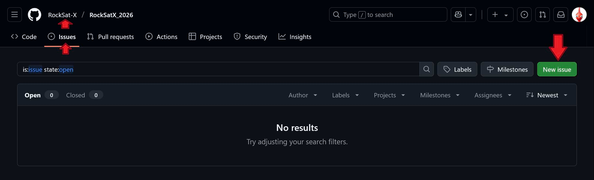
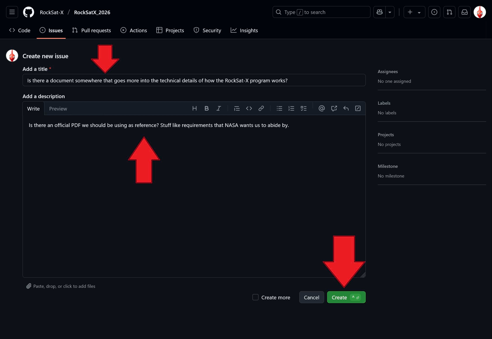
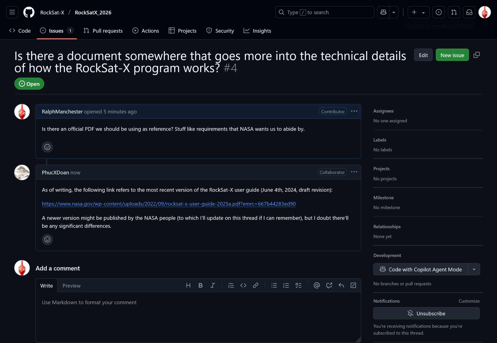
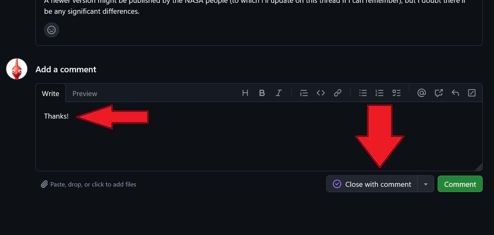
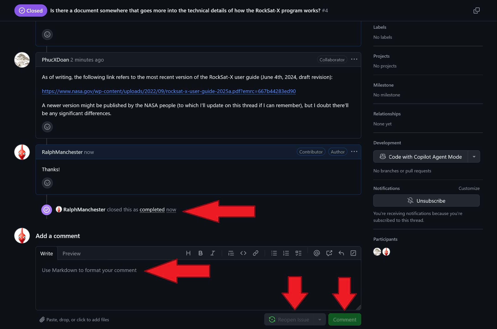
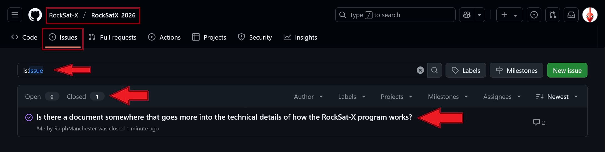
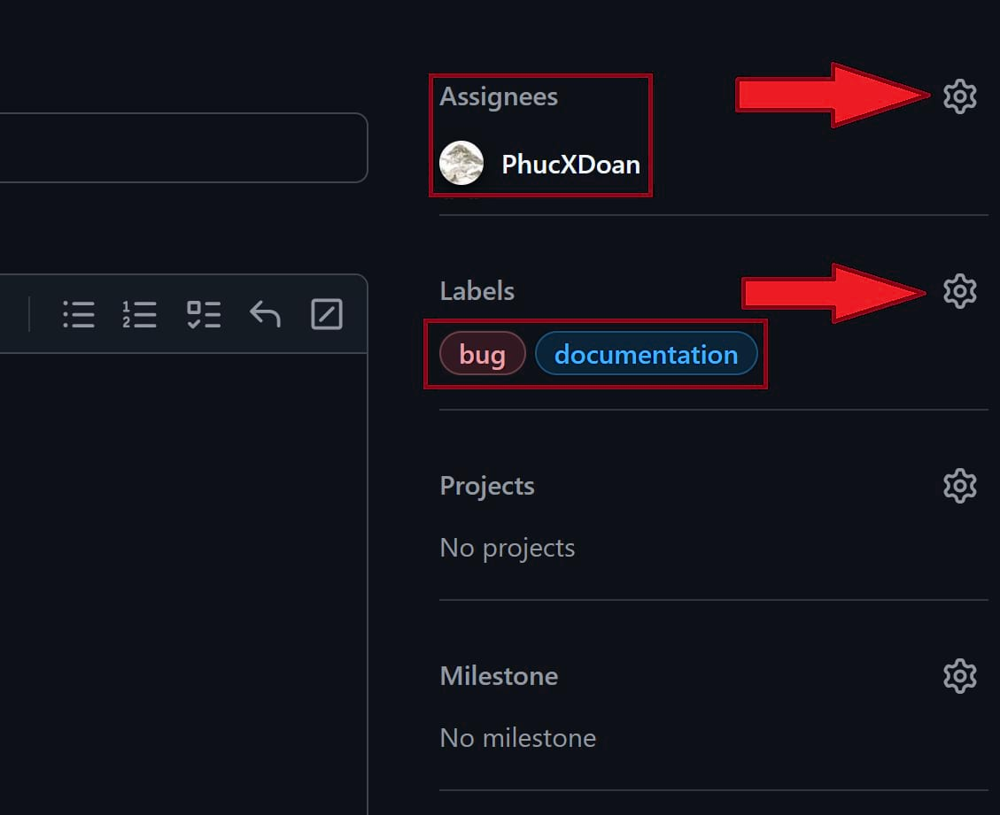
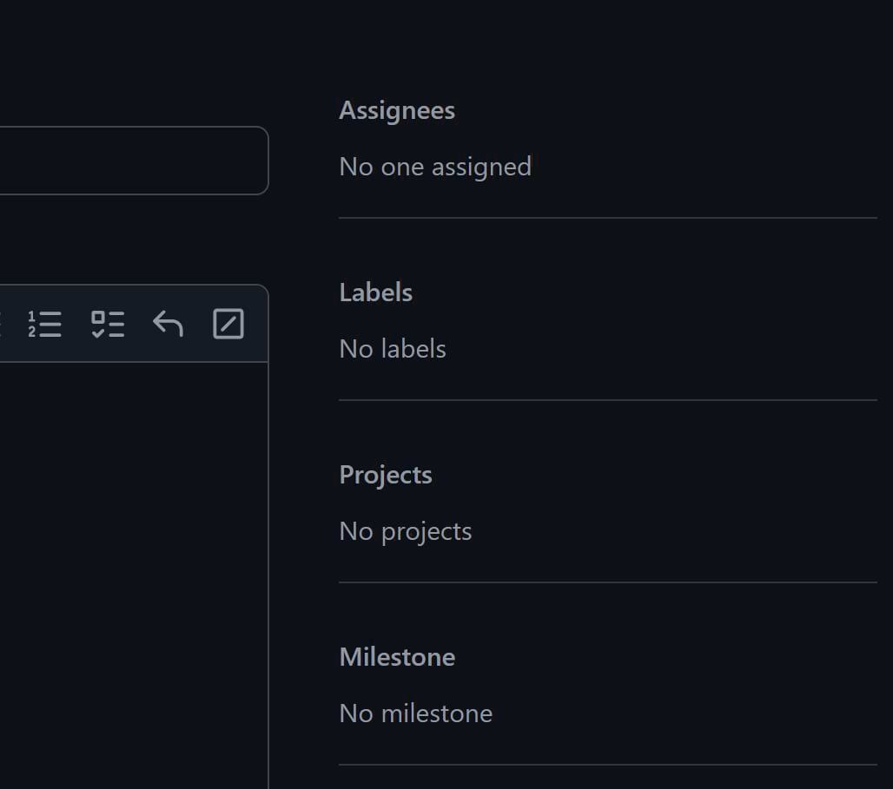

***

# Creating tickets.

If you have questions about the project or things you'd like to see improved upon,
it's best to create a ticket on GitHub.
This is done through the "Issues" tab on the page of the base repository.

Give a summary of your ticket in the title field
and expand it further (if needed) in the description box.

A thread will be created where anyone can contribute to the discussion.

When you feel like you got what you wanted,
you can close the ticket.

Even if the ticket is closed,
the discussion thread can still be commented on or the ticket as a whole be reopened
(which is to make it more obvious that we still need to talk about the subject more).

You'll be able to see the tickets you've made and anyone else's for future prosperity 
on the issue page of the base repository.

That's pretty the gist of using issue tickets on GitHub.

> [!TIP]
> Discord is best reserved for virtual meetings or miscellaneous conversations.
> If you want the quickest response time,
> use Discord,
> but for the sake of bookkeeping,
> create a ticket on GitHub whenever possible.
> Over time,
> the issue tab will serve as a great reference to look back upon for your fellow engineers.

> [!IMPORTANT]
> GitHub Issues can be assigned to specific people and be labled
> (e.g. "bug", "help wanted", "question", etc.)
> as a way to categorize multiple tickets.
>
> 

>
> However due to GitHub's implementation quirks,
> you will not be able to set the assignees or labels for any ticket you create
> unless you have write permissions to the base repository
> (which only your team leads will have).
> What you will see instead are some unconfigurable settings:
>
> 

>
> This is just an unfortunate "issue" of the GitHub Issue ticketing system.
> Your team leads will do their best to organize and address every ticket.

***

# What's Git?

Git is a version control program that keeps track of a project's files throughout its development.
It helps keep track of what files are in the project,
what changes were made to files,
who did those changes,
when they did it,
why they did it,
and so on.

# But why use version control?

Because the old way of dumping files onto Google Drive is unmanagable.
Google Drive is not designed for large, complicated projects where there can be a dozen people making all sorts of changes here and there.
It's good for storing things like presentation slides, pictures, or whatever,
but not critical things like code or CAD files.

# How can I start doing version control?

Start off by downloading the [GitHub Desktop GUI](https://desktop.github.com/download/) application.

Once you go through the installation process,
sign into your GitHub account (make one if you don't already have one).

Once you do that,
go ahead and "clone" the RockSat-X 2026 repository.
To do this,
just copy the URL of the repository `https://github.com/RockSat-X/RockSatX_2026` and pass it to the GUI program.

When you clone the repository,
you now have a local copy of the project on your machine.

Go ahead and create a text file in the folder `people` with the file name of something like `{firstname}{lastname}.md` using your text editor of choice
(e.g. Notepad, Visual Studio Code, Vim, etc.).
In this file,
go ahead give an introduction to who you are!
Do you have any pets?
Do you have an arch nemesis?
Do you faint at the sight of blood?

Once you're done,
save the file and go back to the GUI client.

To show you what it should look like,
I went ahead and created the text file `PhucDoan.md` where I introduced myself.
After I did that,
my GitHub GUI client looks something like this:

TODO

Git detects that I have created a new file that's currently not being tracked.
To start tracking the file,
I go ahead write a summary of what I did (the commit message) and press the big blue commit button.

Once I do that,
Git is now tracking my introduction file!
To see what that means,
let's say I continue to edit the text file even further,
adding some details and fixing typos.

Going back to the GUI client,
I can see the modifications that were made ("diff" is the jargon for this).

Once again,
I can summarize my changes and then press the big blue commit button.

But what does "commiting" actually mean?
You can think of a commit as essentially as a checkpoint on your work so far.
Ideally, a commit should be small and succinct so that your fellow team members can follow along easily.

When you make commits,
however,
they do not appear to everyone on GitHub immediately.
That is,
all the work you've been doing so far is still on your local machine.
To actually push it online,
simply press the "push" button in the GitHub GUI client.

> [!TIP]
> Let's be clear on some vocab:
> - _**Git**_ is the command line program that actually tracks the project files.
> - _**GitHub**_ is a website that can host Git repositories (jargon for "project") so that people can download them from the cloud.
> - _**The GitHub Desktop GUI**_ is a wrapper around the Git program to make it easier for people to use Git (without having to use a terminal)
and also be able to work with the GitHub website easily.
